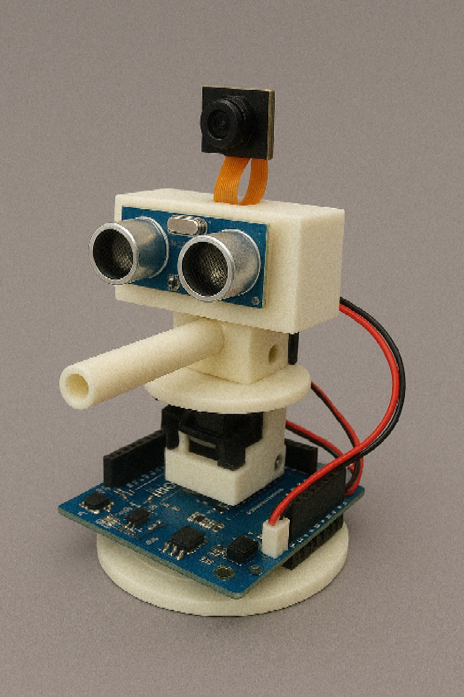

Fait avec Microsoft Paint.

# Tourelle

**Une tourelle intelligente ?**


**Developed by [Soka7](https://github.com/Soka7)**

## 🚀Objectifs

- **Reseau neuronal fait sans librairie.**
- **Fabriquer la tourelle avec arduino.**
- **Faire le code pour les mouvements de la tourelle.**
- **Faire le code pour faire fonctionner le supersonic sensor.**
- **Faire le code pour faire fonctionner la camera.**
- **Faire le code pour convertir l'image en array pour le reseau neuronal.**
- **Faire le code pour envoyer la photo au reseau neuronal.**



Fait avec ChatGPT.

## 🎯 Infos

### Basiques
```bash
# Installer les dependances
pip install -r requirements.txt
```

### Référence README pour une lecture agréable.
```bash
https://github.com/mhucka/readmine/blob/main/README.md?plain=1
```

### Video explicative.
```bash
https://www.youtube.com/watch?v=gPVVsw2OWdM
```

**Professeur: [E.DALDEGAN](https://github.com/edaldegan)**
-----------------------------------------------------------
**[.](https://www.youtube.com/watch?v=ujEph5vFwmc&list=RDujEph5vFwmc&start_radio=1)**